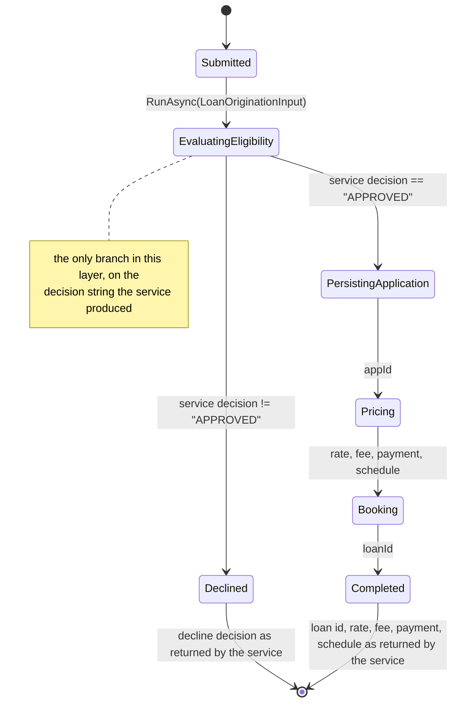

# Layer 3 — Workflow / Orchestration

`src/Contoso.Lending.Workflow` is a Temporal (.NET SDK) workflow plus worker host. It owns
**sequencing, state, retries and timeouts** for loan origination, and nothing else: every
decision, rate, fee, payment and schedule row in its result is a value the layer-2 service
returned over HTTP. `tests/Contoso.Lending.ArchTests` fails the build if that stops being true.

## State diagram



`GetStatus` (query) returns the current stage, the stored service decision and decline reason,
the application and loan ids, and the recorded reviewers. `RecordReviewerAsync` (signal) appends
a reviewer to that state; it changes no outcome.

## Activities

Each activity is a thin `ServiceApiClient` POST. It parses the response and returns it unchanged —
no mapping that rounds, recomputes or reinterprets a value.

| Activity | Endpoint | Returns |
| --- | --- | --- |
| `EvaluateEligibilityAsync` | `POST /api/eligibility/evaluate` | decision, decline reason, fired rule, DTI, LTV, estimated payment, result text |
| `PersistApplicationAsync` | `POST /api/applications` | `appId` |
| `PriceLoanAsync` | `POST /api/pricing/quote` | rate breakdown, origination fee, payment, amortization schedule |
| `BookLoanAsync` | `POST /api/loans` | `loanId` |

Activity options live in the workflow (`ServiceCall`): 30s start-to-close, 5min schedule-to-close,
exponential retry (1s, x2, cap 10s, 5 attempts) with `ServiceApiException` non-retryable — a 4xx/5xx
from the service is a real answer to retry a handful of times, not forever. That is orchestration
policy, which this layer owns.

There is no database access anywhere in this layer: the workflow reaches the system of record only
through the service API.

## Running it

```bash
docker compose up -d postgres temporal          # Temporal dev server: gRPC 7233, UI http://localhost:8233
dotnet run --project src/Contoso.Lending.Api    # layer 2 on :5080
dotnet run --project src/Contoso.Lending.Workflow            # worker on task queue loan-origination
python3 -c "import json; json.dump(json.load(open('parity/scenarios/approved-term-loan.json'))['input'], open('/tmp/input.json','w'))"
dotnet run --project src/Contoso.Lending.Workflow -- start --input /tmp/input.json --out /tmp/run.json
```

Environment: `TEMPORAL_ADDRESS` (default `localhost:7233`), `TEMPORAL_NAMESPACE` (default
`default`), `SERVICE_API_URL` (default `http://localhost:5080`).

## How purity is enforced

`tests/Contoso.Lending.ArchTests` runs in `dotnet test` and has two halves.

**Compiled assembly.** `WorkflowDependencyTests` reads the referenced assemblies of
`Contoso.Lending.Workflow.dll` and its `deps.json` dependency graph, and fails on
`Contoso.Lending.Domain`, `Npgsql`, `Oracle.*`, `System.Data.*` providers, `Microsoft.Data.*`,
EF Core, Dapper and friends. It also asserts the project has no `ProjectReference` at all, so the
domain cannot arrive indirectly.

**Source scan.** `WorkflowPurityTests` runs `WorkflowSourceScanner` over every `.cs` file in the
project (comments and string literals stripped first) and reports, with file and line:

| Rule | Rejects |
| --- | --- |
| `money-arithmetic` | `+ - * / %` applied to an amount, rate, fee, payment, balance, DTI, LTV, score, … |
| `decimal-literal` | money constants such as `0.01m`, `25000m` |
| `fractional-literal` | any fractional constant — it is a rate, ratio or cap |
| `threshold-comparison` | comparing a money/rate/score value against a literal or another such value |
| `rounding` | `Math.*`, `decimal.Round`, `MidpointRounding` — legacy rounding is a layer-2 rule |
| `forbidden-reference` | domain or database types named in source |

Branching on the `decision` string (`eligibility.Decision != Decisions.Approved`) is an equality
check on a service answer, not a threshold, and is allowed. Timeouts and retry intervals are
integral orchestration values, and are allowed. Both are pinned by `Scanner_AllowsOrchestration`,
and each forbidden construct is pinned by `Scanner_RejectsBusinessLogic`, so the gate cannot rot
into a no-op.

## End-to-end gate

`bash parity/run-l4.sh` brings up Postgres and Temporal, applies the schema if needed, seeds the
scenario borrowers, starts the API and the worker, executes every scenario in `parity/scenarios/`
as a real workflow, and compares the final workflow result to the legacy expectations from
`parity/golden/` with zero tolerance (including all 60 amortization rows for the approved term
loan). It writes `parity/reports/l4-e2e.json` (scenario, inputs, expected, actual, mismatches,
pass/fail) and exits non-zero on any mismatch.

Scenario provenance is recorded in each scenario file. Two values are derived rather than copied
verbatim from a golden record, and are documented as such: the approved-term-loan LTV (`100000 /
160000`, whose rate band is golden) and the large-loan origination fee (1% of the amount, between
the golden floor and cap).
